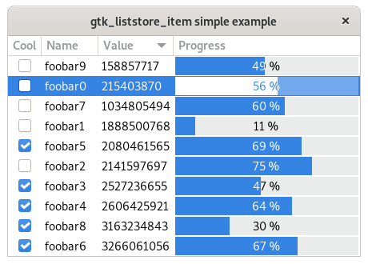

# gtk_liststore_item

[](https://github.com/MicroJoe/gtk_liststore_item/actions/workflows/ci.yml)
[](https://crates.io/crates/gtk_liststore_item)
[](https://docs.rs/gtk_liststore_item)
[](https://crates.io/crates/gtk_liststore_item)

Automatic `gtk::ListStore` struct derive for Rust.



## Usage

In order to use this crate, you have to add the following dependencies into
your project's `Cargo.toml` file:

```toml
[dependencies]
gtk_liststore_item = "1.0.1"
```

## Example

After the crate is installed, you can enjoy the `ListStoreItem` derive!

```rust
use gtk::prelude::*;

use gladis::Gladis;
use gtk_liststore_item::ListStoreItem;

const GLADE_SRC: &str = r#"
<?xml version="1.0" encoding="UTF-8"?>
<!-- Generated with glade 3.22.2 -->
<interface>
  <requires lib="gtk+" version="3.20"/>
  <object class="GtkListStore" id="list_store">
    <columns>
      <!-- column-name name -->
      <column type="gchararray"/>
      <!-- column-name value -->
      <column type="guint"/>
    </columns>
  </object>
</interface>
"#;

#[derive(Gladis)]
struct Glade {
    list_store: gtk::ListStore,
}

#[derive(ListStoreItem)]
struct Item {
    name: String,
    value: u32,
}

fn main() {
    gtk::init().unwrap();

    let mut glade = Glade::from_string(GLADE_SRC).unwrap();

    let item = Item { name: "foobar".into(), value: 42 };
    let iter = item.insert_into_liststore(&mut glade.list_store);

    let retrieved_item = Item::from_liststore_iter(&glade.list_store, &iter).unwrap();
    assert_eq!("foobar", retrieved_item.name);
    assert_eq!(42, retrieved_item.value);
}
```

Without this crate, you would have to manually serialize each of the entries in
your struct with their type and position:

```rust
fn get_item(liststore: &gtk::ListStore, iter: &gtk::TreeIter) -> Item {
    Some(Item {
        name: list_store.value(&iter, 0).get::<String>().ok()?,
        value: list_store.value(&iter, 1).get::<u32>().ok()?,
    })
}

fn insert_item(item: &Item, list_store: &mut gtk::ListStore) -> gtk::TreeIter {
    list_store.insert_with_values(
        None,
        &[
            (0, &self.name),
            (1, &self.value)
        ]
    )
}
```

This can become pretty boring, hence this crate to ease the process.

## License

Licensed under either of [Apache License, Version 2.0](LICENSE-APACHE) or [MIT
license](LICENSE-MIT) at your option.

Unless you explicitly state otherwise, any contribution intentionally submitted
for inclusion in this project by you, as defined in the Apache-2.0 license,
shall be dual licensed as above, without any additional terms or conditions.
